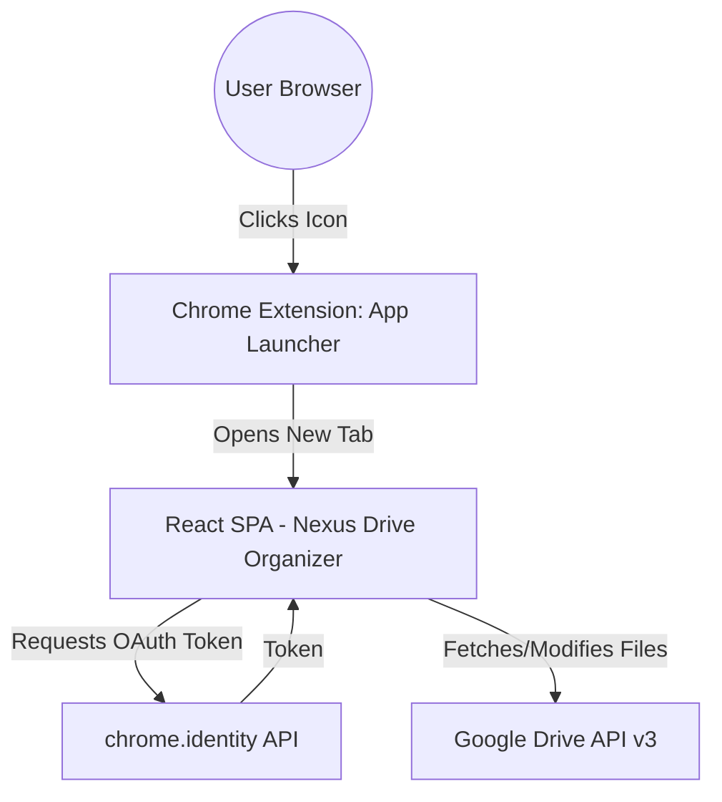

# Nexus Drive Organizer 🚀

A standalone, React + Vite Chrome Extension designed to centralize, triage, and organize Google Drive files with a premium dark-mode, glassmorphism UI. Extracted from a larger productivity suite, this tool is now a lightweight, client-side browser extension for maximum portability and ease of use.

---

## 🏗️ Visual Architecture

The application is designed as a Manifest V3 Chrome Extension. It functions as an **App Launcher**, where clicking the extension icon launches the full SPA in a new tab. It interacts directly with Google's APIs, authenticated natively via Chrome, keeping the infrastructure footprint minimal (no servers or Docker required).



---

## ✨ End-to-End User Experience

1. **Authentication:** The user clicks the extension icon, launching the app. The app automatically prompts for Google Drive access via Chrome's native OAuth UI.
2. **Dashboard Initialization:** The app fetches "loose" files from the root of the user's Drive, presenting them in a sleek, glassmorphism grid.
3. **Triage Modes:**
   - **Manual Mode:** Users can drag-and-drop files into existing folders, create new folders on the fly, or drop files into the "Trash Bin" zone.
   - **AI Auto-Pilot:** The app analyzes file names and metadata to automatically suggest category folders (e.g., "Invoices", "Design Assets"). 
4. **Execution:** Upon confirming AI suggestions or manual drops, the React app orchestrates the `PATCH` requests to Google Drive APIs to move the files instantaneously.

---

## 🔒 Security & Authentication

Because this app handles sensitive cloud documents, security is handled via Chrome's built-in Identity API:

### Current Implementation
- **Native Chrome OAuth (`chrome.identity`):** All Google OAuth tokens remain entirely in the browser memory and extension secure storage. We do not use third-party scripts.
- **Scope Restriction:** The app only requests the minimum required Google scopes to read and move files (`auth/drive`, `auth/calendar`).

### Publishing to the Public
To publish this extension to the public Chrome Web Store, the Google Cloud Project's OAuth Consent Screen must pass Google's rigorous Trust & Safety verification process to remove the "Unverified App" warning.

Because Google's automated verification bots require a static Application Home Page and cannot parse React SPAs, this repository utilizes a **Hybrid Deployment Architecture**:
- The React application is built and loaded natively inside the Chrome Extension environment.
- A pure static HTML landing page (`public/about.html`) is deployed to **Vercel** (`https://nexus-drive-organizer.vercel.app`), serving as the verified, public-facing home page for Google Trust & Safety bots.

---

## 🗄️ Backend & Features

The app currently minimizes backend dependencies by operating entirely client-side.

### Data Models
- **Google Drive Entities:** We rely on Google Drive as the "Source of Truth" for file schemas (IDs, mimeTypes, webViewLinks) and Storage Quota metrics (`/about?fields=storageQuota`).
- **No Mocked Overheads:** The app is purely focused on Drive orchestration. Legacy Momentum OS mock schemas for tasks and projects have been stripped out.

### Key Features
1. **Smart File Triage:** Drag-and-drop or select multiple items to quickly sort into folders or bulk-trash.
2. **Storage Health Dashboard:** A full-page analytic view that instantly pulls your active Google Drive quota, identifies your largest files, oldest untouched files, and precise duplicates to free up storage space.

---

## 🚀 Getting Started (For Developers)

This app is a standard Vite React app, configured to output a Chrome Extension.

### Prerequisites
- Node.js & npm installed.
- A valid Google Cloud Console Project with the **Google Drive API** and **Google Calendar API** enabled.

### 🔑 How to get a Google Client ID
To build this extension, you must provide a Google Client ID:
1. Go to the [Google Cloud Console](https://console.cloud.google.com/).
2. Create a new Project and enable the Drive and Calendar APIs.
3. Navigate to **APIs & Services > Credentials**.
4. Click **Create Credentials > OAuth client ID**.
5. Choose **Chrome App** (or Chrome Extension).
6. Provide your Extension's 32-character ID.
7. Copy your generated **Client ID**.

### Setup Instructions

1. **Clone & Configure:**
   Open `public/manifest.json` and replace the placeholder with your actual Client ID:
   ```json
   "oauth2": {
     "client_id": "your-client-id-here.apps.googleusercontent.com",
     ...
   }
   ```

2. **Build the Extension:**
   ```bash
   npm install
   npm run build
   ```

3. **Load into Chrome:**
   - Go to `chrome://extensions` in Google Chrome.
   - Enable **Developer Mode** (top right).
   - Click **Load unpacked**.
   - Select the `dist` folder generated by the build step.
   - Click the extension icon in your toolbar to launch the app!
