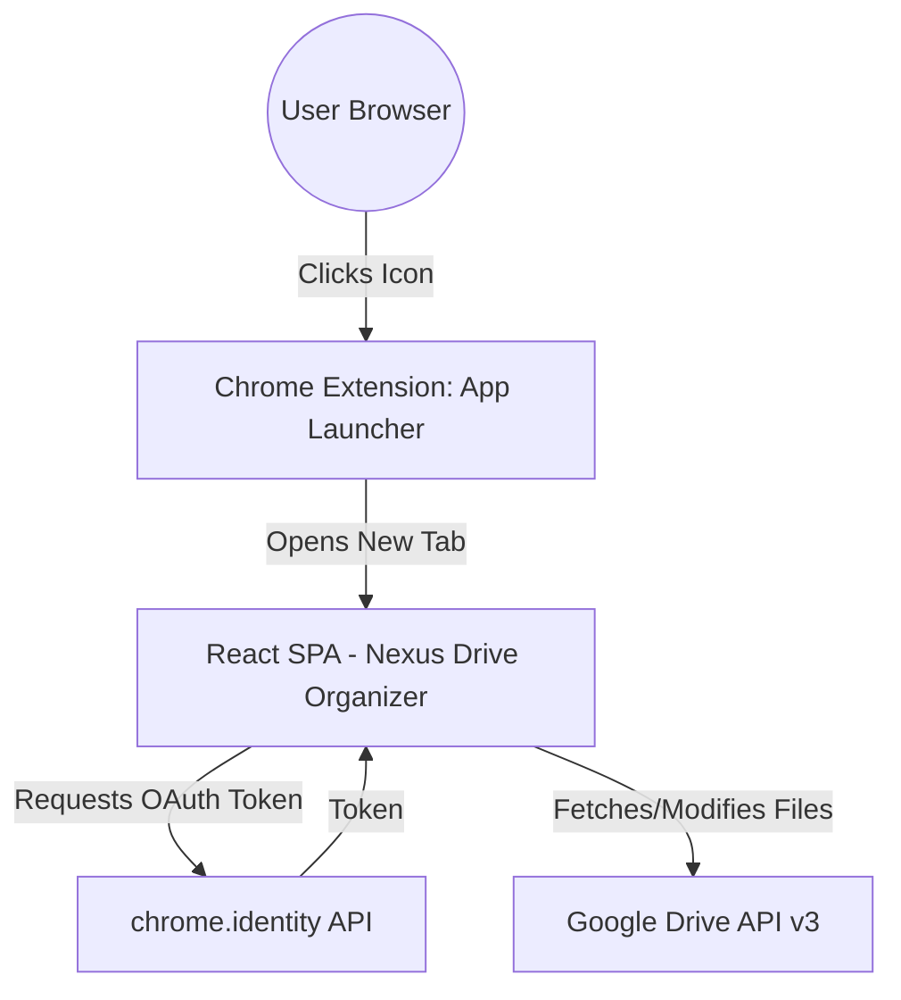

# System Architecture

## High-Level Overview

Nexus Drive Organizer is a Chrome Extension built with React and Vite. It functions as an **App Launcher**; clicking the extension icon launches the full-page React application in a new tab.

All Google Drive interactions happen directly from the extension to Google's Drive APIs, authenticated via `chrome.identity` (Manifest V3 native OAuth — no external scripts required).

## Core Components
- **`public/background.js`**: Background service worker that listens for the extension icon click and launches the app.
- **`src/App.jsx`**: Root component. No router — the extension renders directly into the new tab.
- **`src/pages/DriveOrganizer.jsx`**: Core UI managing file browsing, drag-and-drop, and AI workflows.
- **`src/lib/gdrive.js`**: Google Drive API integration layer. Uses `chrome.identity.getAuthToken` for OAuth.
- **`src/lib/ai.js`**: (Stubbed) AI logic for suggesting folder structures.
- **`src/lib/db.js` / `src/lib/fileMeta.js`**: (Stubbed) Internal state mocking for task/project linking.
- **`public/manifest.json`**: Manifest V3 configuration declaring permissions and New Tab override.
